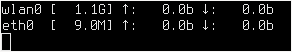

# netsp
A simple bandwidth monitor



## How to compile

```
make
```

## How to install (root)

```
make install
```

## How to uninstall (root)

```
make uninstall
```
## How to use

```
netsp [NET_PREFIX_1] [NET_PREFIX_2] ...


netsp w e
netsp wlan eth
```

## License
MIT
